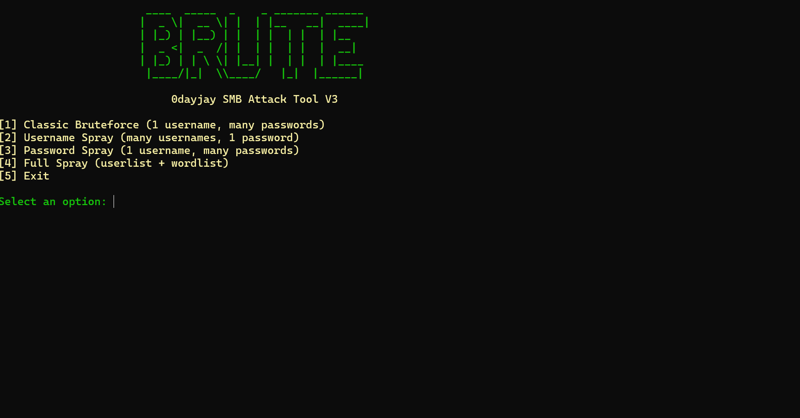

# BRUTEv3 - SMB Attack Tool
### Developed by 0dayjay

<center>

# BRUTEv3
**Multi-Mode SMB Password Attack Tool**

</center>

---

## 🚀 Overview
BRUTEv3 is a **multi-mode SMB password attack tool** built for **ethical hacking**, **penetration testing**, and **red-team operations**.  
It offers **classic bruteforce**, **username spray**, **password spray**, and **full spray** functionalities — all with **multi-threading**, clean logging, and a professional user experience.

---

## ✨ Features

- 🛡️ Classic Bruteforce (1 username, many passwords)
- 🛡️ Username Spray (many usernames, 1 password)
- 🛡️ Password Spray (1 username, many passwords carefully)
- 🛡️ Full Spray (userlist + passwordlist carefully rotated)
- 🛡️ Multi-threaded attacks (user-controlled with `--threads`)
- 🛡️ Success logging with timestamp, target IP, attack mode, username, and password
- 🛡️ Clean console banner and menu system
- 🛡️ Works on Windows **and Linux** (Python 3.9+), fully portable with `.exe` option for Windows

---

## 🛠️ Usage Example

```bash
python smb_bruteforce_v3.py --threads 10
```

Then select your attack mode:

```
[1] Classic Bruteforce
[2] Username Spray
[3] Password Spray
[4] Full Spray
[5] Exit
```

✅ Enter your Target IP, Usernames, Passwords when prompted.

✅ All successes are saved to `successful_logins.txt`.

✅ Failures are logged to `attempt_log.txt`.

---

## 🧠 Requirements

- Python 3.9+
- `impacket` library
- `concurrent.futures` (built-in)
- Windows / Linux compatible

To install impacket:

```bash
pip install impacket
```

---

## ⚠️ Legal Notice
This tool is intended **for educational purposes and authorized testing only**.  
You must have **explicit permission** to run this against any system.  
The developer is **not responsible** for misuse or illegal activities.

---

## 📚 About 0dayjay
- Ethical Hacker | Penetration Tester | Developer
- Building custom offensive security tools for real-world ops
- Passionate about responsible cybersecurity

---
# 📣 Example Screenshot:



---

# ✅ End of README
